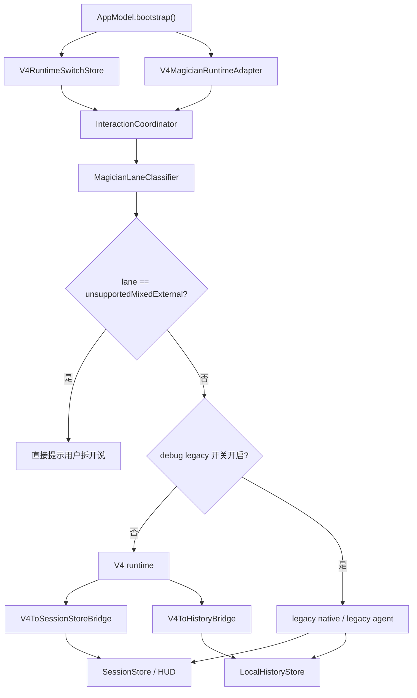

# V4 总架构蓝图

目标：UI 不动，交互入口不动，功能边界不减；把当前 `/Users/zhuanghongkai/Desktop/颠覆性 AI 语音输入法/Sources/Core/Interaction/InteractionCoordinator.swift` 里那条旧主链，换成 claudecode 风格的统一内核。

状态更新（Window 10）：

- V4 已默认启用，并且是魔术先生唯一默认主链。
- legacy runtime 只保留 debug 显式开关兜底，不再默认初始化，不再承担日常执行。

## V4 目标目录

```text
/Users/zhuanghongkai/Desktop/颠覆性 AI 语音输入法/Sources/Core/V4/
├── AgentLoop/
│   ├── V4AgentLoop.swift
│   ├── V4TurnState.swift
│   ├── V4LaneRouter.swift
│   ├── V4LoopEvent.swift
│   └── V4LoopBridge.swift
├── ToolKernel/
│   ├── V4ToolKernel.swift
│   ├── V4ToolRegistry.swift
│   ├── V4ToolCall.swift
│   ├── V4ToolResult.swift
│   ├── V4ToolPermission.swift
│   └── Adapters/
├── Memory/
│   ├── V4MemoryRecord.swift
│   ├── V4MemoryIndex.swift
│   ├── V4MemoryRetriever.swift
│   └── V4HistoryBridge.swift
├── Prompt/
│   ├── V4PromptLayer.swift
│   ├── V4PromptComposer.swift
│   ├── V4SceneLayer.swift
│   ├── V4SkillLayer.swift
│   └── V4DictionaryLayer.swift
├── Model/
│   ├── V4ModelSlot.swift
│   ├── V4ModelSlotResolver.swift
│   ├── V4ModelRequest.swift
│   └── V4ModelResponse.swift
└── TimeMachine/
    ├── V4TimeMachineContracts.swift
    ├── V4TimeMachineService.swift
    ├── V4TimeParser.swift
    ├── V4ReminderScheduler.swift
    ├── V4TimeMachineStore.swift
    └── V4UserProfileDigest.swift
```

## 模块职责

### `Sources/Core/V4/AgentLoop/*`

- 接住三个 lane：普通听写、魔术先生、一口气全念对。
- 管理 turn state、max turns、当前 phase、下一步动作。
- 接住 `ToolKernel` 的结构化结果，再决定是否继续下一轮。
- 对外只发结构化 loop events，UI 不直接碰内部细节。

### `Sources/Core/V4/ToolKernel/*`

- 统一注册工具，不再把工具逻辑绑在 `MagicianToolExecutor.swift` 这一个巨型文件里。
- 每个工具有固定 schema、权限规则、执行器、结果格式。
- `Feishu CLI`、Mail、Calendar、Notes、Music、TextOutput 都走同一层。
- 支持 pre-tool / post-tool 钩子，方便后续接 telemetry、trace、回放。

### `Sources/Core/V4/Memory/*`

- 从 `/Users/zhuanghongkai/Desktop/颠覆性 AI 语音输入法/Sources/Core/History/LocalHistoryStore.swift` 读取历史记录。
- 把 `SessionHistoryEntry` 变成可检索的 memory records。
- 面向 V4 提供 retrieval，而不是只给 UI 列表页看。

### `Sources/Core/V4/Prompt/*`

- 合并当前散落在以下文件里的 prompt 输入源：
  - `/Users/zhuanghongkai/Desktop/颠覆性 AI 语音输入法/Sources/Core/Skills/SkillRuleStore.swift`
  - `/Users/zhuanghongkai/Desktop/颠覆性 AI 语音输入法/Sources/Core/Context/AppScenePolicyStore.swift`
  - `/Users/zhuanghongkai/Desktop/颠覆性 AI 语音输入法/Sources/Core/Speech/ASRDictionaryStore.swift`
  - `/Users/zhuanghongkai/Desktop/颠覆性 AI 语音输入法/Sources/Core/Context/ContextDetector.swift`
- 形成统一 prompt layering：system / scene / dictionary / memory / lane / tool-result。

### `Sources/Core/V4/Model/*`

- 继续使用 `/Users/zhuanghongkai/Desktop/颠覆性 AI 语音输入法/Sources/Core/Speech/ProviderSettingsStore.swift` 里的三槽位配置。
- 但真正的槽位解析、lane 选模、tool step 选模、fallback，不再散在旧 runtime 内。
- `asrConfig`、`textConfig`、`cliTextConfig` 变成 V4 的输入，不再直接决定业务分支。

## PromptStack 与 ModelSlots

Window 07 之后，V4 runtime 内部不再直接从 `SkillRuleStore`、`AppScenePolicyStore`、`ProviderSettingsStore` 到处拉字符串或模型配置，而是统一先过两层：

1. `V4PromptStackResolver`
2. `V4ModelSlotManager`

### PromptStack 固定层级

固定顺序如下：

1. `Global`
2. `NowYouSeeMe`
3. `AppScene`
4. `TimeMachine`
5. `Lane`
6. `Task`

合并规则：

- `systemPrompt`：按层级顺序拼接，并写入 `[LayerName]` 标记。
- `guidance`：按 key 合并；同 key 后层覆盖前层。
- `constraints`：按 key 合并；同 key 后层覆盖前层。
- `userPrompt`：后层覆盖前层，当前默认由 `Task` 层给最终版本。

输出结构固定为：

- `finalSystemPrompt`
- `finalGuidancePrompt`
- `finalUserPrompt`
- `appliedLayers`

### Now you see me 映射

`V4SkillRuleBridge` 负责把旧规则映射到 V4 prompt：

- `spokenFilter`
  - 变成输入清洗说明，落在 `NowYouSeeMe.guidance.inputCleaning`
- `appPreferenceBoost`
  - 控制 `AppScene` 层是否允许注入当前应用偏好
- `systemPrompt`
  - 直接进入 `NowYouSeeMe.systemPrompt`

规则关闭时，不允许注入该段；参数为空时，也不允许制造空段。

### ModelSlots 固定三槽位

`V4ModelSlotManager` 统一维护：

- `asr`
- `text`
- `agent`

桥接层是 `V4ProviderSettingsBridge`，它只从旧 store 读取：

- `asrConfig`
- `textConfig`
- `cliTextConfig`

当前默认规则：

- `agent -> cliTextConfig`
- 将来如果要给 `agent` 单独 provider，只扩 `V4ProviderSettingsBridge`，不改 V4 tool / loop 接口

### 当前接线点

- `V4AgentLoopEngine`
  - 每轮先解析 `promptStack` 和 `modelSlots`
  - 再把解析结果写回 `V4RunRequest`
- `V4TextTransformTool`
  - 只读 `request.promptStack`
  - 只读 `request.modelSlots`
  - 不再直接摸 `ProviderSettingsStore.rewriteConfiguration`
- `V4ToHistoryBridge`
  - 会把 `prompt_stack / model_slots` 摘要写进 execution trace，方便后续做时光机回放

### `Sources/Core/V4/TimeMachine/*`

- 第一版正式接入 V4 主循环，入口只走魔术先生命令路径，不改左侧导航。
- `V4TimeMachineService`
  - 统一处理“仅记录”和“记录并提醒”两类命令。
- `V4TimeParser`
  - 解析常见中文时间表达，失败时返回结构化 hint，不允许静默失败。
- `V4ReminderScheduler`
  - 只走本地通知，不依赖云端；负责申请通知权限、创建本地提醒、回填通知 ID。
- `V4TimeMachineStore`
  - 数据固定落到 `history/time-machine-items-v1.json`。
- `V4UserProfileDigest`
  - 从条目中提炼高频主题、常见提醒时段、常见 action 标签，反哺 prompt / memory 轻量个性化。
- 当前不新增独立页面；如果以后需要露出 UI，只能挂到现有分区里的局部面板。

## 数据流

### 统一主线

1. 麦克风输入进入 `/Users/zhuanghongkai/Desktop/颠覆性 AI 语音输入法/Sources/Core/Hotkey/GlobalHotkeyService.swift`。
2. `GlobalHotkeyService` 继续调用 `/Users/zhuanghongkai/Desktop/颠覆性 AI 语音输入法/Sources/Core/Interaction/InteractionCoordinator.swift` 的公开入口：
   - `handleWakeInput(context:)`
   - `handleBrainstormInput()`
   - `handleStopInput()`
3. `InteractionCoordinator` 在 V4 里只做入口桥接：录音、ASR 请求、把结果送入 `V4AgentLoop`。
4. `V4AgentLoop` 根据 lane 与上下文做分类：
   - `directDictation`
   - `selectionRewrite`
   - `brainstormDiscussion`
5. `V4PromptComposer` 组装 prompt layers，`V4MemoryRetriever` 拉相关历史，`V4ModelSlotResolver` 选模型槽位。
6. 模型返回 tool plan 或文本结果；若有工具调用，交给 `V4ToolKernel`。
7. `V4ToolKernel` 现在已支持 `time_machine.create / time_machine.remind`，tool result 会带回条目 ID、时间解析摘要、提醒调度结果；`V4AgentLoop` 决定是否继续下一轮。
8. 最终结果写回：
   - 文本写回仍经 `/Users/zhuanghongkai/Desktop/颠覆性 AI 语音输入法/Sources/Core/TextOutput/TextOutputCoordinator.swift`
   - 历史仍先落到 `/Users/zhuanghongkai/Desktop/颠覆性 AI 语音输入法/Sources/Core/History/LocalHistoryStore.swift`
   - 时光机条目单独落到 `history/time-machine-items-v1.json`

### Interaction 接线图（V4 默认）

Window 10 之后，`selectionRewrite` 的默认执行链已经固定为 V4。`InteractionCoordinator` 还保留 legacy runtime，但只给 debug 显式开关兜底，默认启动时不会主动初始化 legacy stack。



接线规则固定如下：

- `AppModel.bootstrap()` 统一创建 `V4RuntimeSwitchStore` 和 `V4MagicianRuntimeAdapter`，再注入 `InteractionCoordinator`。
- `selectionRewrite` 在 debug 开关关闭时，只能走 `V4RuntimeSwitchStore.route(for:) == .v4`。
- legacy debug 开关打开后，也只有真正进入 legacy route 时才会懒初始化旧 runtime；预检失败仍按 V4 默认主链记历史。
- `unsupportedMixedExternal` 继续在 lane 判定后直接拦截，不能因为切到 V4 把混合命令保护绕开。
- V4 运行中的事件统一经 `V4ToSessionStoreBridge` 映射到 `SessionStore/HUD`，最终 outcome 经 `V4ToHistoryBridge` 写入历史与 trace。
- legacy runtime 仍保留在 `InteractionCoordinator`，但代码注释已标成 `legacy fallback only`，后续只给 debug 排查用。

### lane 视角

- 普通听写：麦克风 -> ASR -> Prompt Layer（词典 + scene + spokenFilter）-> `V4AgentLoop` 快速文本链 -> 写回 / 历史
- 魔术先生：麦克风 -> ASR -> lane 分类 -> `V4AgentLoop` 多轮计划 -> `V4ToolKernel` -> 历史 / 时光机 / 本地提醒 / 状态回推
- 一口气全念对：麦克风 -> ASR -> lane 分类 -> `V4AgentLoop` 上下文整理链 -> 输出摘要 / 对话稿 / 历史

## 主循环状态机

`V4AgentLoopEngine.run(...)` 当前按固定状态机推进，目标是先把 turn-based loop 跑通，再把 ToolKernel 和 Prompt/Model 细节逐窗接上。

1. `queued`
   接到 `V4RunRequest`，发 `request_accepted`。
2. `planning`
   调 `V4Planner.plan(...)`。若 planner 直接给出 fail / finish decision，则本轮直接结束。
3. `executing`
   执行当前 turn 的 step。每个 step 独立维护 retry 计数。
4. `retrying`
   step 返回 retryable error 且没超过 `maxRetryPerStep` 时进入；发 `step_retry_scheduled`。
5. `verifying`
   每个 step 完成后调 `V4Verifier.verify(...)`，生成 verification result 与 evidence summary。
6. decision
   `V4PostStepDecider.decide(...)` 返回四种动作：
   - `continue`：若当前 turn 已无剩余 step，则进入下一 turn。
   - `finish`：构造 `V4RunOutcome(status: .completed)`。
   - `ask_user`：构造 `V4RunOutcome(status: .waitingForUser)`。
   - `fail`：构造 `V4RunOutcome(status: .failed)`。
7. `completed / waiting_for_user / failed`
   发最终事件并返回 outcome。

当前 turn 上限是 `maxTurns`，默认每个 step 最多重试 `2` 次；超限时统一落成 `max_turns_exceeded`。

## UI 不变但内核替换的边界规则

1. 左侧分区继续固定在 `/Users/zhuanghongkai/Desktop/颠覆性 AI 语音输入法/Sources/UI/ControlCenterState.swift` 里的 `home / memory / dictionary / skills / model / magician / agentBrainstorm / settings`。
2. `/Users/zhuanghongkai/Desktop/颠覆性 AI 语音输入法/Sources/UI/SettingsView.swift` 里的 page 入口继续保留：`memoryPage`、`dictionaryPage`、`skillsPage`、`modelPage`、`magicianPage`、`agentBrainstormPage`、`settingsPage`。
3. 交互入口继续保留当前热键语义：
   - 主键单击：普通听写
   - 主键长按：魔术先生
   - 脑暴键双击：一口气全念对
4. `/Users/zhuanghongkai/Desktop/颠覆性 AI 语音输入法/Sources/Core/Session/SessionStore.swift` 保留为 UI-facing 状态壳，但不再持有核心业务判断。
5. `/Users/zhuanghongkai/Desktop/颠覆性 AI 语音输入法/Sources/Core/Interaction/InteractionCoordinator.swift` 以后只做入口桥、状态桥、错误桥，不再继续长出 V4 业务分支。
6. 禁止继续把新逻辑堆进 `/Users/zhuanghongkai/Desktop/颠覆性 AI 语音输入法/Sources/Core/Magician/MagicianAgentModels.swift` 的 `MagicianNativeRuntime` / `MagicianAgentRuntimeV3` 主链。
7. `ProviderSettingsStore`、`SkillRuleStore`、`ASRDictionaryStore`、`LocalHistoryStore` 先留作桥接层；等 V4 跑稳后，再把执行逻辑从旧文件内移走。
8. 时光机先做内核能力，再决定 UI 入口放在哪；当前窗口不改左侧菜单。

## 时光机模块

### 字段模型

当前条目结构 `V4TimeItem` 固定包含：

- `id`
- `createdAt`
- `rawCommand`
- `normalizedText`
- `scheduledAt`
- `notificationID`
- `tags`
- `status`

同时保留 `sessionID / runID / traceID / lane`，方便后续把条目和 V4 trace 对齐。

### ToolKernel 接线

当前已接入两个正式 tool：

- `time_machine.create`
  - 处理无时间的灵感、待办、备忘
- `time_machine.remind`
  - 处理带时间的提醒命令

planner 的 rule-based 路由规则是：

- 命中“提醒我 / 本地提醒 / 闹钟 / 时间表达”优先走 `time_machine.remind`
- 命中“记一下 / 记下来 / 灵感 / 待办 / todo”走 `time_machine.create`

### 时间解析与提醒边界

当前 parser 已覆盖：

- `今晚 8 点`
- `明早 9 点`
- `下周一上午`
- `30 分钟后`

当前不覆盖：

- 多时间点拆分
- 农历 / 节假日推导
- 复杂时间区间，比如“这周工作日晚上 8 点以后”
- 自动反查用户时区历史

提醒调度边界：

- 只使用本地通知
- 只在解析到单个明确时间点时调度
- 调度结果会把 `notificationID` 回填进条目
- 权限没开或系统调度失败时，条目仍然保留，状态记为 `schedule_failed`

## 当前架构判断

1. 最先该拆的是旧主链，不是页面。
2. `InteractionCoordinator` 应变薄，`V4AgentLoop` 应变厚。
3. `MagicianToolExecutor.swift` 不该再当系统级工具总入口；V4 要把它拆成 ToolKernel adapters。
